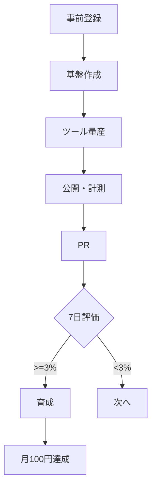

# 月100円マネタイズ計画（PWA量産）

**目的**：まずは「月100円」を現実に稼ぐ体験を作る  
**思想**：小さく作る／早く出す／数字で判断する

---

## 0. ゴールと前提

- ゴール：**月100円以上の収益**
- フェーズ：検証フェーズ（副業ではなく実験）
- 優先収益源：
  1. 投げ銭
  2. アフィリエイト
  3. 広告（AdSenseは後回し）

---

## 1. 作る前にやる登録・アカウント準備（Day0）

### 必須アカウント
- GitHub（コード管理）
- Vercel（ホスティング／GitHub連携）
- Google Analytics 4（計測）
- 投げ銭サービス（Buy Me a Coffee or Ko-fi）

### 推奨設定
- すべて **2段階認証（2FA）をON**
- 投げ銭はまず1サービスだけでOK

### 後回しでOKなもの
- 独自ドメイン
- AdSense（実績が出てから）

---

## 2. サイト構成（共通テンプレ）

```
/
├─ /tools
│   ├─ /total      # 合計計算ツール
│   ├─ /xxx        # 次のツール
├─ /about
├─ /privacy
```

### 共通要素
- Analytics（PV / action / share）
- 投げ銭導線（MonetizeBar）
- X共有ボタン

---

## 3. 開発フェーズ

### Phase 0：基盤（1日）
- Next.js + Vercel 公開
- About / Privacy 作成
- GA4 設置
- 投げ銭リンク設置

### Phase 1：量産（7〜14日）
- 目標：**10ツール**
- ルール：
  - 1ツール1機能
  - DBなし（localStorageまで）
  - 1日最大4時間

### Phase 2：選別（公開7日後）
- 指標：
  - action_clicked / PV
  - share_clicked / PV

| 判定 | アクション |
|---|---|
| >=3% | 育成 |
| 1〜3% | 文言改善 |
| <1% | アーカイブ |

### Phase 3：育成
- CTA改善
- 説明文改善
- 投げ銭文言調整

---

## 4. PR（集客）の型

### 使用媒体
- X（メイン）
- note（週1まとめ）

### X投稿テンプレ
```
【気づき・異常・構造】
↓
自分用にツール作った
↓
URL
↓
よかったらブクマ/共有☕
```

### 投稿ルール
- ツール説明は主役にしない
- スクショ1枚必須
- ハッシュタグは2〜4個

---

## 5. 収益モデルとPV目安

### 投げ銭
- 投げ銭率：0.1〜0.5%
- 目標：**月500〜1000PVで1回発生**

### アフィリエイト
- 月1000〜3000PVで100円目安

### AdSense（参考）
- 月2000〜10000PVで100円
- 今回は非推奨

---

## 6. KPI（見る数字はこれだけ）

- PV
- action_clicked / PV
- share_clicked / PV

※ 売上より「反応」を見る

---

## 7. 全体フロー図



---

## 8. 判断基準（迷ったら）

- 迷ったら出す
- 迷ったら数字を見る
- 迷ったら育てず次へ

---

## 9. この計画の意味

> 月100円は「収益」ではなく
> **誰かが価値を感じた証拠を1回得ること**

ここを超えたら、500円・1000円は設計の延長線。

