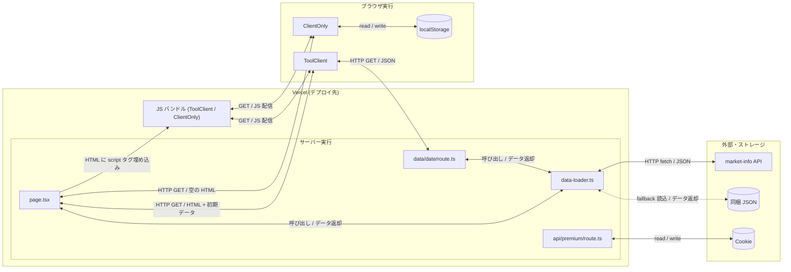
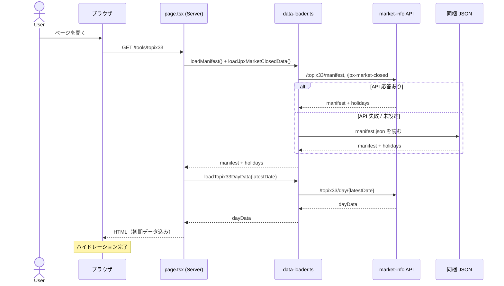
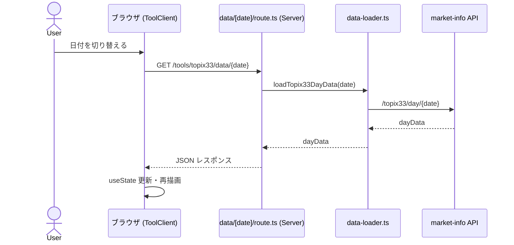
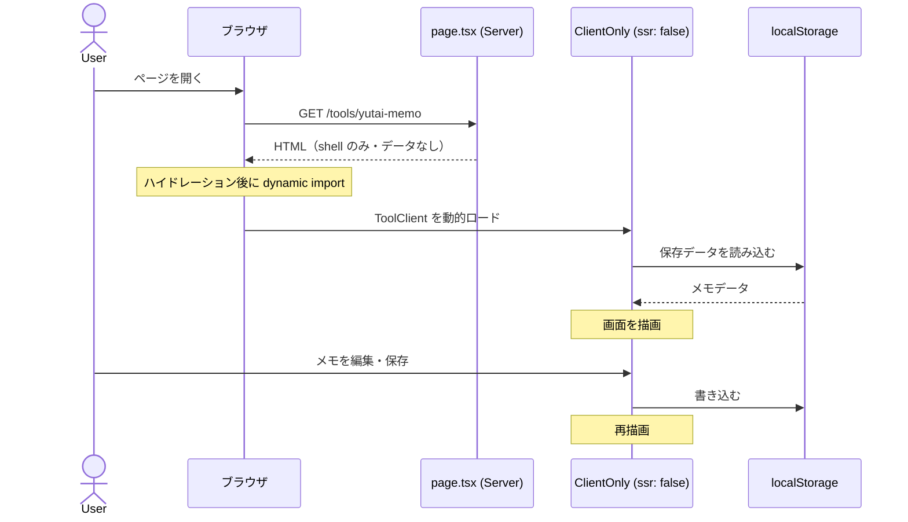

# React Server / Client 設計分担

このドキュメントは、mini-tools における Server Component と Client Component の役割分担、および外部依存の全体像を整理したものです。

---

## 全体パターン

ツールは大きく **2 パターン** に分類できます。

| パターン | 対象ツール | page.tsx の形 | 初期データ |
|---|---|---|---|
| **A: SSR + ToolClient** | market data 系 | `async function Page()` | サーバーがロードして props 渡し |
| **B: ClientOnly** | localStorage 系 | `function Page()` (sync) | なし（ブラウザ専有） |

### システム図



---

## パターン A: SSR + ToolClient（market data 系）

```
page.tsx (Server Component)
  ├─ data-loader.ts で外部 API / ローカル JSON を取得
  ├─ 休場日フィルタ・日付絞り込みを処理
  └─ <ToolClient data={...} /> にすべて渡す

ToolClient.tsx (Client Component, "use client")
  ├─ 初期データを useState で保持
  ├─ 日付・月の切替ボタン操作を受け付ける
  ├─ 切替時は内部 API route (data/[date]/route.ts) を fetch
  └─ ローディング・エラー状態を表示
```

### シーケンス図

**フェーズ 1: 初回ページロード**（topix33 を例に）



**フェーズ 2: 日付切替**



### ツール別の server 側処理

| ツール | server が取得するもの | searchParams |
|---|---|---|
| topix33 | manifest + 休場日 + 初期日次データ | なし |
| stock-ranking | manifest + 休場日 + 初期日次データ | なし |
| nikkei-contribution | manifest + 休場日 + 初期日次データ | なし |
| us-stock-ranking | manifest + 初期日次データ（最大5日試行） | なし |
| earnings-calendar | 国内全月データ + 海外最新データ | なし |
| yutai-candidates | 指定月の優待データ + 信用情報 | `?month=` |
| market-rankings | manifest + 指定月データ | `?type=` `?month=` |

### ToolClient の共通責務

- 日付・月の切替 UI（ユーザー操作を受ける）
- 切替時に `data/[date]/route.ts` を fetch してデータ更新
- `useState` でローカルデータ状態を管理
- ローディングスピナー・エラーメッセージの表示
- hover / tooltip / アコーディオンなどのインタラクション

---

## パターン B: ClientOnly（localStorage 系）

```
page.tsx (Server Component, sync)
  └─ <ClientOnly /> を描画するだけ（データ渡しなし）

ClientOnly.tsx
  └─ dynamic(() => import('./ToolClient'), { ssr: false }) でロード

ToolClient.tsx ("use client")
  ├─ localStorage を読み書き
  └─ すべての状態をブラウザ内で管理
```

### シーケンス図



### ツール別の用途

| ツール | 保存内容 |
|---|---|
| yutai-memo | 優待銘柄のメモ・タグ・権利月など |
| yutai-expiry | 優待有効期限の管理データ |
| charcount | テキスト入力（明示的保存はなし） |
| total | 合計計算の入力テキスト |

> **yutai-expiry だけ例外:** page.tsx が `<ShareButtons>` をサーバー側で描画し、`<ClientOnly>` を内包する構造。ShareButtons は SSR で問題ないため server shell に残している。

---

## 外部依存の一覧

### 1. market-info API（`MARKET_INFO_API_BASE_URL`）

`lib/market-api.ts` の `getApiBaseUrl()` / `fetchJson()` を経由。5 秒タイムアウト、300 秒 revalidate。

| ツール | 取得エンドポイント |
|---|---|
| topix33 | `/topix33/manifest` `/topix33/day/{date}` |
| stock-ranking | `/stock-ranking/manifest` `/stock-ranking/day/{date}` |
| nikkei-contribution | `/nikkei-contribution/manifest` `/nikkei-contribution/day/{date}` |
| us-stock-ranking | `/us-stock-ranking/manifest` `/us-stock-ranking/day/{date}` |
| earnings-calendar（海外） | `/earnings-calendar/overseas/manifest` `/earnings-calendar/overseas/latest` `/earnings-calendar/overseas/monthly/{ym}` |
| yutai-candidates | manifest, monthly, credit 各エンドポイント |
| market-rankings | `/market-rankings/{type}/manifest` `/market-rankings/{type}/monthly/{ym}` |

API 未設定（`MARKET_INFO_API_BASE_URL` が空）の場合、各 data-loader はローカル JSON fallback に切り替える。

### 2. リポジトリ同梱 JSON（`app/tools/**/data/`）

| ツール | 用途 |
|---|---|
| earnings-calendar（国内） | API なし・同梱データのみ |
| stock-ranking | API 失敗時の fallback |
| nikkei-contribution | API 失敗時の fallback |
| topix33 | API 失敗時の fallback |
| market-rankings | API 失敗時の fallback |
| us-stock-ranking | API 失敗時の fallback |

### 3. Browser localStorage

| ツール | キー体系 |
|---|---|
| yutai-memo | 銘柄コードごとのメモオブジェクト |
| yutai-expiry | 期限管理エントリ |
| total | 入力テキスト |
| charcount | 入力テキスト |

### 4. Cookie（premium 認証）

- Cookie 名: `mini_tools_premium`
- 署名・検証: `lib/premium-auth.ts`
- login / logout: `app/api/premium/login/route.ts` / `app/api/premium/logout/route.ts`

---

## 内部 API ルート（クライアント日付切替用）

ToolClient からの日付切替 fetch を受けるサーバールート。

| パス | 対象ツール |
|---|---|
| `app/tools/topix33/data/[date]/route.ts` | topix33 |
| `app/tools/stock-ranking/data/[date]/route.ts` | stock-ranking |
| `app/tools/nikkei-contribution/data/[date]/route.ts` | nikkei-contribution |
| `app/tools/us-stock-ranking/data/[date]/route.ts` | us-stock-ranking |

いずれも `_shared/date-data-route.ts` の `buildDateDataRoute()` を使って実装している。  
earnings-calendar / yutai-candidates / market-rankings は初回にすべてのデータを server で渡すため、クライアント側の日付 fetch ルートは持たない。

---

## Server / Client の責任境界まとめ

| 関心事 | Server | Client |
|---|---|---|
| データ取得 | ○ data-loader 経由 | ─（初期は props で受取） |
| 日付切替後の fetch | ─ | ○ 内部 route を fetch |
| 休場日フィルタ | ○ page.tsx 内で処理 | ─ |
| SEO / Metadata | ○ `export const metadata` | ─ |
| アクセス制御（premium） | ○ Cookie を読む | ─ |
| localStorage 読み書き | ─ | ○ useEffect で後注入 |
| インタラクション状態 | ─ | ○ useState |
| ローディング表示 | ─ | ○ |

---

## 関連ドキュメント

- [SSR / Hydration / localStorage 運用ガイド](./decision-log/2026-03-12-ssr-localstorage-hydration-guidelines.md)
- [mini-tools システム構成概要](./system-architecture-overview.md)
- [Market Tools データ取得経路一覧](./market-tools-data-fetch-paths.md)
